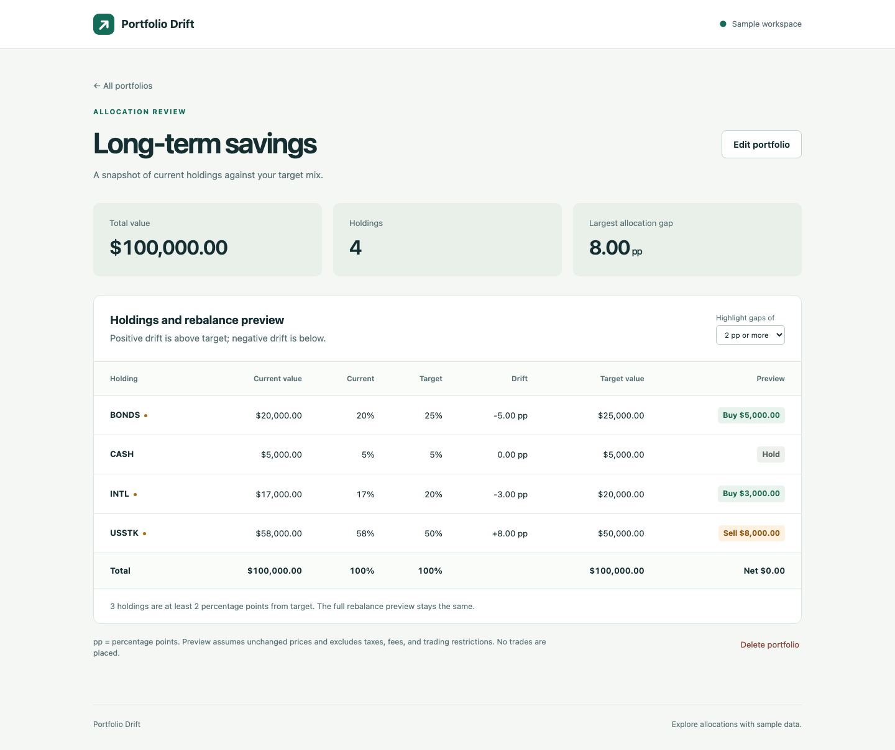

# Portfolio Drift

A small Ruby on Rails learning project for exploring an advisor's portfolio allocation workflow. Enter holdings and target weights, see which positions have drifted, and preview the dollar amounts needed to rebalance.



## What it does

- Create, edit, and delete portfolios with up to 12 holdings.
- Validate unique symbols, nonnegative values, and target allocations totaling 100%.
- Show current weights, drift in percentage points, and hypothetical buy/sell amounts.
- Update target totals while editing with Stimulus, and highlight drift above a selected threshold.
- Preserve every cent when rounding target amounts, so the preview's buys and sells net to zero.

## Stack

Ruby 3.3, Rails 8.1, PostgreSQL 16, ERB, Turbo, and Stimulus. JavaScript uses Rails import maps; no Node build step. Tests use Minitest.

## Run locally

Install Ruby 3.3.1 or newer (the latest 3.3 patch is recommended), Bundler, and PostgreSQL 16. Start PostgreSQL and make sure your database user can create databases.

```sh
git clone https://github.com/Tincaniam/portfolio-drift.git
cd portfolio-drift
bundle install
bin/setup
```

Open [localhost:3000](http://localhost:3000). The first setup creates two fictional example portfolios. Set `PGHOST`, `PGPORT`, `PGUSER`, and `PGPASSWORD` if your PostgreSQL installation requires them. The default host is `localhost` and the default port is `5432`.

`bin/rails db:seed` adds any missing example portfolios without overwriting existing ones.

### Docker alternative

```sh
docker compose up --build
```

Open [localhost:3000](http://localhost:3000). The app and PostgreSQL run together, and database contents persist in a named Docker volume. The example database credentials in `compose.yml` are for this local demo only; the database has no published host port and the web app binds to localhost.

```sh
docker compose exec web bin/rails test
docker compose down
```

## Try it

1. Open **Long-term savings**: the total is $100,000.
2. USSTK holds $58,000 against a 50% target, so it is 8 percentage points above target.
3. The preview shows selling $8,000 of USSTK, buying $3,000 of INTL and $5,000 of BONDS, and leaving CASH alone.
4. Edit a target. Stimulus shows the new total immediately. Rails rejects the save unless targets total 100%.
5. Change the highlight threshold. It changes which rows are flagged, not the rebalance calculation.

## How the calculation works

For each holding:

```text
current weight = current value / portfolio total × 100
allocation drift = current weight − target weight
trade amount = rounded target value − current value
```

Target values are computed in integer cents using rational arithmetic. Each amount is rounded down first; remaining cents go to the largest fractional remainders, with symbols breaking ties. This keeps the portfolio total unchanged. Stored monetary amounts and target percentages use PostgreSQL decimal columns.

See [the code walkthrough](docs/walkthrough.md) for the request flow and the small set of files to study.

## Checks

```sh
bin/rails test
bin/rubocop
bin/brakeman --no-pager --exit-on-warn --exit-on-error
```

The tests cover invalid allocations, duplicate symbols, zero and negative values, nested updates/removals, rollback on invalid edits, deletion, and cent rounding. A browser pass also checks the Stimulus interactions and mobile layout.

Local verification: 25 tests and 133 assertions pass; RuboCop reports no offenses and Brakeman reports no warnings. Browser checks cover creating, editing, deleting, validation errors, live totals, threshold changes, and the mobile layout. Docker startup has not yet been verified.

An optional [GitHub Actions workflow](docs/github-actions-ci.yml) runs these Ruby checks and a Docker startup check. It is not enabled in this repository: the publishing connection lacks workflow permission. To enable it with an authorized GitHub sign-in, move the file to `.github/workflows/ci.yml` and commit it.

## Scope and learning

This is an AI-assisted hobby project intended for learning Rails conventions and practicing explanation of the code. It uses fictional symbols and manually entered dollar values. It does not connect to a brokerage, use live prices, or place trades. The preview excludes taxes, fees, tax lots, and trading restrictions.

The app is a local, single-user demo without authentication or authorization. Adding user-owned portfolios would be necessary before hosting it as a shared service. It does not demonstrate production portfolio-management or tax-optimization expertise.

Useful next exercises: add CSV import with validation, add account ownership, or persist dated allocation snapshots. Keep each change small and cover its behavior with a test.

## References

- [Rails getting started](https://guides.rubyonrails.org/getting_started.html)
- [Rails nested attributes](https://api.rubyonrails.org/classes/ActiveRecord/NestedAttributes/ClassMethods.html)
- [Stimulus handbook](https://stimulus.hotwired.dev/handbook/introduction)
